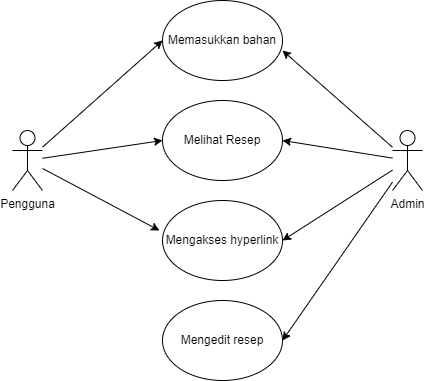
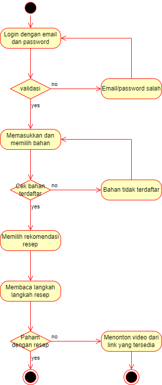
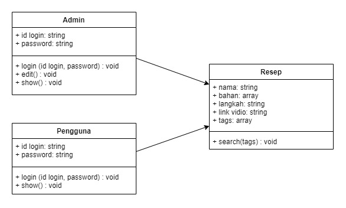

# Seadanya
Sebuah aplikasi untuk memberikan saran dan resep berdasarkan bahan masakan yang telah diinput oleh user.

OTW Capstone 

Ketua Kelompok : Pramudya Kusuma Hardika - 20/460558/TK/51147 
Anggota 1 : Alfath Nuurlatihf Sulistanto - 20/460538/TK/51127 
Anggota 2 : Rahmiyatul Hasanah YE - 20/460561/TK/51150  
 

## Use Case Diagram  
  

## Activity Diagram  
  

## Class Diagram  
  

## ERD  

